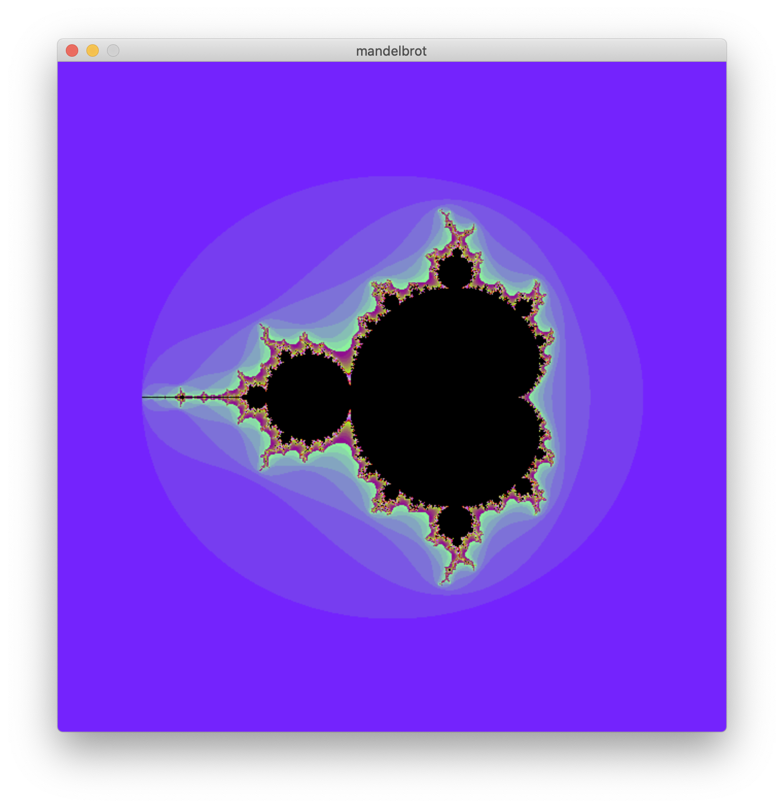
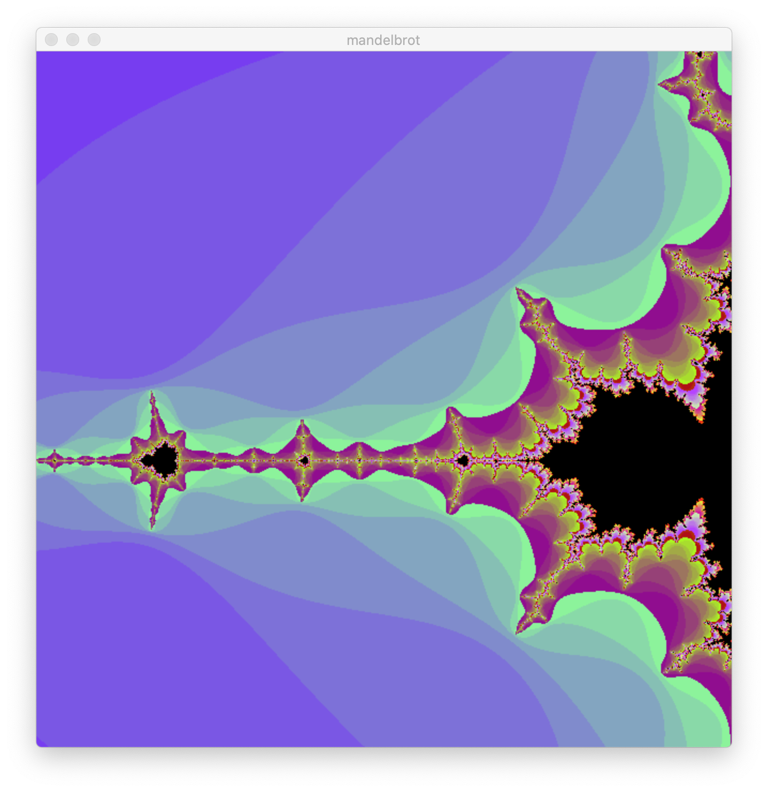
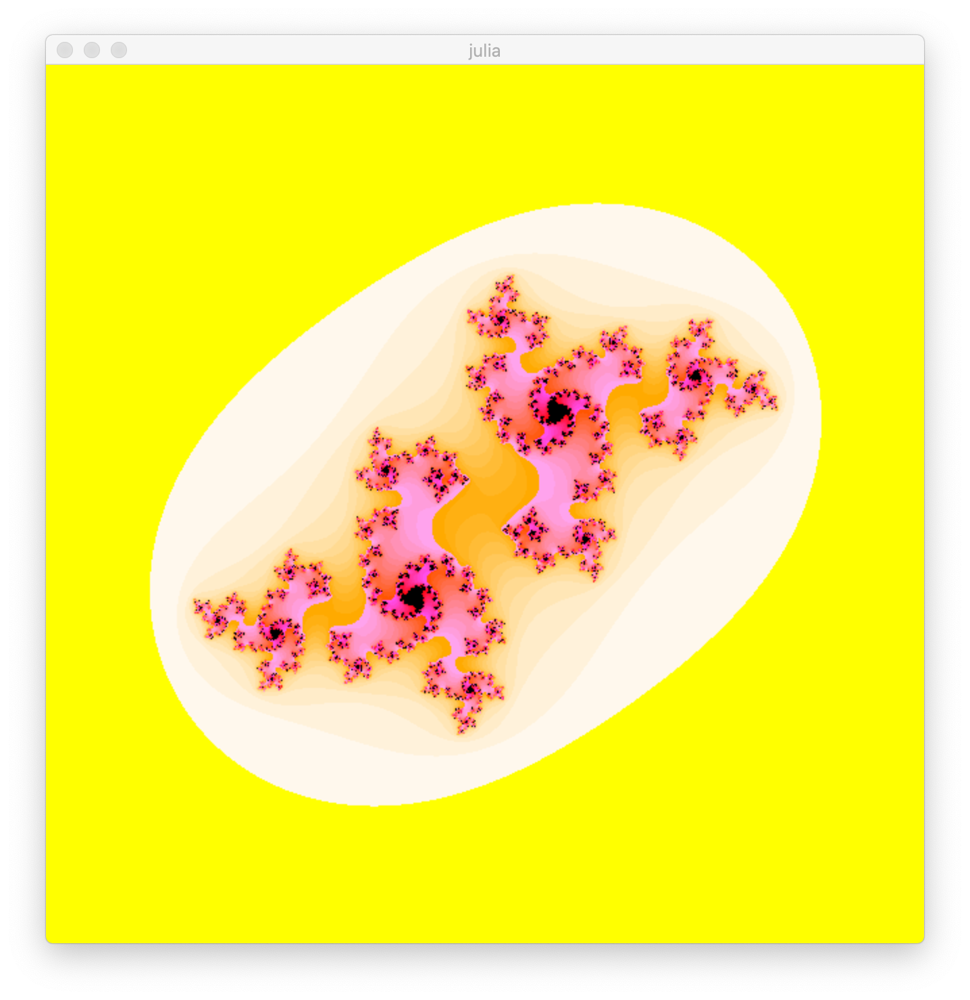

# Rendering fractols

The programm renders Mandelbrot and Julia fractols using [mlx](https://harm-smits.github.io/42docs/libs/minilibx/getting_started.html) library.  

The program was written as part of a [42 programming school](https://42.fr/en/homepage/) project, 
in particular [42 Abu Dhabi school](https://42abudhabi.ae/).

## Table of Contents
- [Installation && How to compile](#installation-&&-how-to-compile)
- [Features](#features)
- [Buttons](#buttons)
- [Examples](#some-examples)

<!-- # Description
What the fractol is? Why there are different fractols in the world? 
Whats the difference between Mandelbrot and Julia? What paramentrs the Julia needs? -->

## Installation && How to compile
```bash
git clone https://github.com/sabdulki/fractol_42.git

make re
```
For Mandelbrot farctol please use:
```bash
./fractol mandelbrot
```
For the Julia:
```bash
./fractol julia x y
```

Instaed of `x` and `y` please type any numbers betwen 2 and -2 for both paramenetrs. For the most beautiful and fascinating renderings I suggest you to try these: 
- -0.800000 0.172308
- -0.781538 0.166154
- -0.800000 0.184615
-  0.375385 0.369213
- -0.553846 -0.516923
- -0.800000 -0.190769
And whatether you want from 2 to -2.

## Features

```bash
make re && make bonus```
```bash 
./fractol julia 1 1
```

The feature is that the fractol is changing by mouse movement. 
Hover the mouse over the programm window and you'll see a kind of magic :sparkles:

### Buttons

Don't hesitate to press some buttons:
- 'W': the body of fractol becomes white
- 'B': the body of fractol becomes black
- 1 - 4: the fractol chages the colours :one: :two: :three: :four:

- Don't forget about the arrows: press up, down, left, right - the image will be shifting :arrow_up: :arrow_down: :arrow_left: :arrow_right:
- And the most important - the mouse wheel. Try to **zoom in** and **zoom out** - you'd like it! :cyclone:

The programm suppoused to zoom infinetely, so try it out :wink:

`Disclamer` 
It's **not recomended** to use features described above **while rendering** Julia fractol **with mouse movement**. It could crash the programm or make it a bit slowly.

## Some examples
<!--  -->



